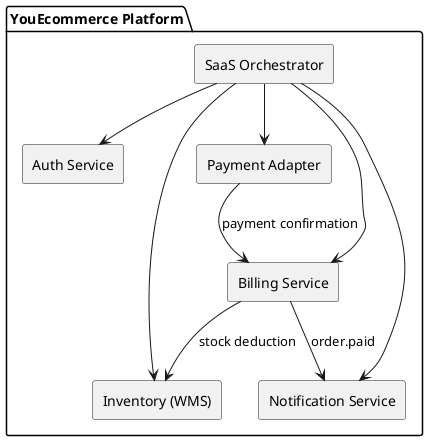

## 🧭 Introducción

**YouEcommerce** es una plataforma modular de ecommerce orientada a SaaS.  
Su arquitectura se basa en **servicios desacoplados y reutilizables**, que pueden operar juntos (en un ecosistema) o individualmente como microproductos.

Cada módulo está diseñado con:
- **Clean Architecture + DDD**
- **Multi-tenant** desde el diseño
- **Integraciones estandarizadas (REST / eventos)**
- **Feature Flags** para pruebas A/B y activación progresiva
- **Escalabilidad horizontal**

---

## 🏗️ Estructura general

YouEcommerce-Docs/
├── Introducción.md
├── Decisiones Tecnicas.md
├── Auth Service/
│ └── Overview AuthService.md
├── Billing Service/
│ └── Overview Billing Service.md
├── Inventory Service/
│ └── Overview Inventory Services.md
├── Notification Service/
│ └── Overview NotificationService.md
├── Payment Adapter/
│ └── Overview Payment Adapter.md
└── README.md

---
## 🧩 Módulos principales

| Módulo                      | Rol                                                  | Enlace                                                                             |
| --------------------------- | ---------------------------------------------------- | ---------------------------------------------------------------------------------- |
| **Auth Service**            | Autenticación, autorización y multi-tenancy          | [Auth Service](./Auth%20Service/Overview%20AuthService.md)                         |
| **Billing Service**         | Gestión de órdenes, totales e integración fiscal     | [Billing Service](./Billing%20Service/Overview%20Billing%20Service.md)             |
| **Inventory (WMS) Service** | Control de productos, stock y movimientos de almacén | [Inventory Service](./Inventory%20Service/Overview%20Inventory%20Services.md)      |
| **Notification Service**    | Envío centralizado de emails, webhooks y eventos     | [Notification Service](./Notification%20Service/Overview%20NotificationService.md) |
| **Payment Adapter**         | Integración unificada con múltiples pasarelas        | [Payment Adapter](./Payment%20Adapter/Overview%20Payment%20Adapter.md)             |

---

## ⚙️ Arquitectura general

El ecosistema está compuesto por servicios independientes que se comunican mediante **HTTP REST**, con la posibilidad futura de incorporar **eventos asincrónicos** (RabbitMQ, NATS, etc.).

### Diagrama conceptual (PlantUML)



## 🧾 Convenciones de APIs

#### 🔹Estándar general

- Formato: application/json
- Versionado por URL: /v1/...
- Fechas en ISO8601 UTC (yyyy-MM-ddTHH:mm:ssZ)

#### 🔹Autenticación obligatoria vía Authorization: Bearer

- Respuestas uniformes:
```JSON
{
  "success": true,
  "data": { },
  "errors": []
}
```

#### 🔹 Naming
- Tipo	Convención:
	- Endpoint	/resource, /resource/{id}
	- Operaciones:	
		- GET (lectura), 
		- POST (creación), 
		- PATCH (update parcial), 
		- DELETE (borrado lógico)
		- PUT (update completos)
	- Códigos HTTP:	
		- 200 (OK) 
		- 201 (Creado) 
		- 400 (Error validación) 
		- 401 (Auth) 
		- 404 (No encontrado) 
		- 500 (Error interno)

#### 🔹 Seguridad

- JWT firmado (HS256) al inicio → RS256 con JWKS en producción.
- Control de acceso basado en claims: tenant_id, user_id, role.
- Rate limiting y auditoría activables por feature flag.

#### 🧪 Feature Flags – Estándar de uso

- Naming convention:
	- modulo.funcionalidad.modo

- Ejemplo:
	- billing.real_enabled
	- auth.password_reset
	- notifications.retry_enabled

#### Tipos de flags

| Tipo         | Ejemplo                     | Description                                  |
| ------------ | --------------------------- | -------------------------------------------- |
| Global       | notifications.retry_enabled | Controla comportamiento del sistema completo |
| Tenant       | billing.real_enabled        | Configurable por cliente                     |
| Experimental | auth.oauth_google           | Permite tests de nuevas features             |

#### Gestión recomendada

- Motor principal: Unleash (self-hosted)
- Flags persistidas por entorno (dev, stage, prod)
- Todos los servicios deben leer flags desde ConfigService común o cache distribuido.

#### 🧭 Versionado y releases

| Convención         | Ejemplo      | Descripción            |
| ------------------ | ------------ | ---------------------- |
| SemVer             | v1.3.2       | Mayor, menor, patch    |
| Rama principal     | main         | Última versión estable |
| Rama de desarrollo | develop      | Integración continua   |
| Hotfixes           | hotfix/x.y.z | Correcciones críticas  |

#### 🧰 Stack tecnológico base

| Capa           | Tecnología                    |
| -------------- | ----------------------------- |
| Backend        | .NET 9 + ASP.NET Core         |
| Base de datos  | SQL Server o Postgres         |
| Frontend       | Angular                       |
| Contenedores   | Docker / Compose              |
| CI/CD          | GitHub Actions / Azure DevOps |
| Flags          | Unleash / Azure App Config    |
| Observabilidad | Serilog + App Insights        |
| Arquitectura   | Clean Architecture + DDD      |


✨ Créditos
Arquitectura: Santiago Sotelo y Ezequiel Benitez

Documentación técnica: Equipo tecnico

Última actualización: 17-10-2025